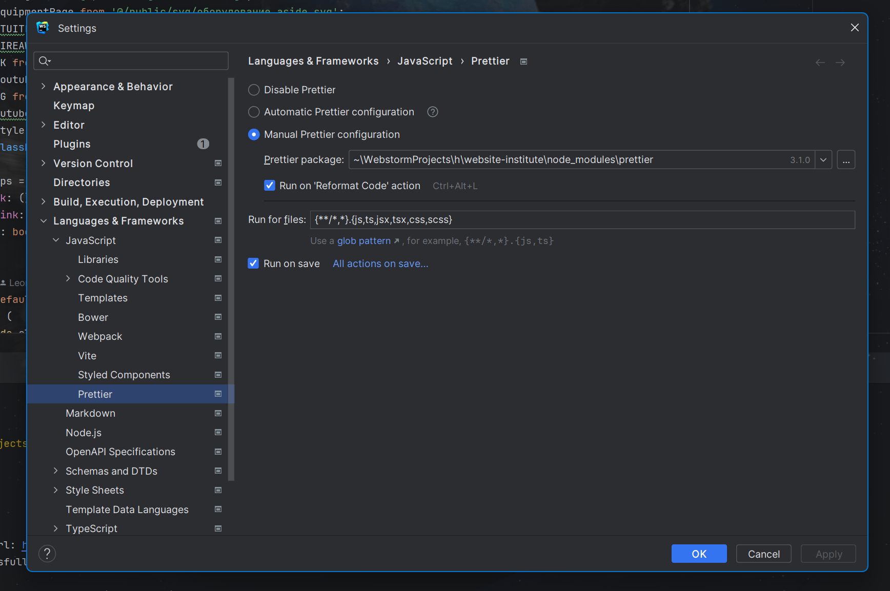

## Запуск сайта при помощи node.js

Запуск для ЭВМ на ОС windows 10/11, с заранее установленной версией node.js - 20.10.0 и версией npm - 10.2.1 (возможно использование более старых версий npm)

```bash
# Установить все зависимости/библиотеки
npm install
# Режим разработчика
npm run dev
# Собрать сборку
npm run build
# Запустить сборку (необходимо сперва запустить в режиме разработчика, пройтись по всем страницам, и только потом собрать сборку)
npm run start
```

## Запуск сайта при помощи docker'а

```bash
docker build -t website-institute .
docker run -p 3000:3000 website-institute
```

## Запуск авто форматирования кода (eslint + prettier)
Авто форматирование кода будет запускаться каждый раз при сохранение файла, рекомендуется включить авто-сохранение файлов, чтобы ещё сильнее автоматизировать процесс разработки 

Работа и запуск prettier осуществляется через IDE, ниже представлен скриншот настройки prettier в IDE Webstorm

Инструкция по запуску prettier в других IDE представлена на этой [странице](https://prettier.io/docs/en/editors)

Опции форматирования кода представлены на этой [странице](https://prettier.io/docs/en/options) (не рекомендуется изменять)

